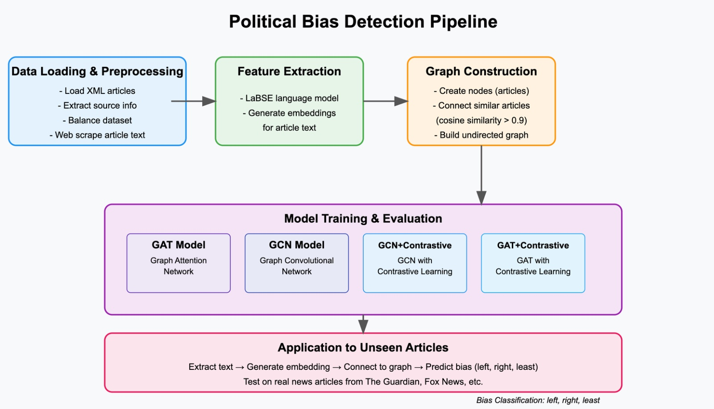

# BiasNet: A Contrastive GNN-Based Framework for Political Stance Detection in News

This project implements a Graph Neural Network (GNN) based framework for detecting political bias in news articles. The system uses contrastive learning to identify and classify the political stance of news content.


*Figure 1: Overview of the BiasNet pipeline showing the data flow from input articles to bias classification*

## Project Structure

- `Preprocessing.ipynb`: Contains data preprocessing steps for preparing the news articles dataset
- `EDA.ipynb`: Exploratory data analysis of the dataset including bias distribution and text analysis
- `main.ipynb`: Main implementation of the BiasNet model
- `dataset/`: Directory containing the news articles dataset, both unprocessed xml file and processed csv file

## Setup

1. Install the required dependencies:
```bash
pip install numpy pandas matplotlib seaborn nltk wordcloud squarify torch_geometric networkx
```

2. Download NLTK data:
```python
import nltk
nltk.download('stopwords')
```

## Key Features

- Political bias detection in news articles
- Graph Neural Network based architecture (GAT, GCN)
- Contrastive learning approach 
- Text preprocessing and analysis
- Visualization of bias distribution and text patterns


